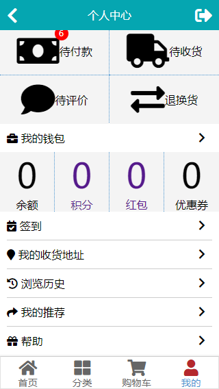

# vue-shop

服务端：[PHP-ZoDream](https://github.com/zx648383079/PHP-ZoDream/tree/master/Module/Shop) 未上线

使用 typescript 重构此项目

## 页面

[√] 首页


[√] 分类页


[√] 搜索页


[√] 商品详情页


[√] 店铺首页

[√] 餐饮类店铺首页


[√] 商品评论显示页


[√] 购物车页


[√] 结算页


[√] 支付页


[√] 个人中心页




[√] 浏览记录页

[√] 个人账户页（包含提现、充值弹窗）


[√] 个人账户记录页

[√] 银行卡页

[√] 银行卡绑定页

[√] 发票页

[√] 发票申请页

[√] 发票抬头页

[√] 发票抬头编辑页

[√] 发票记录页

[√] 登录注册页


[√] 订单列表页


[√] 订单详情页


[√] 商品收藏页

[√] 消息页

[√] 账号关联页


[√] 个人信息页


[√] 账户注销页

[√] 登陆设备管理页

[√] 修改密码页

[√] 实名认证页

[√] 收货地址页


[√] 收货地址编辑页


[√] 评论商品页

[√] 发表评论页

[√] 退换货页

[√] 退换货申请页

[√] 文章列表页


[√] 文章分类页

[√] 文章详情页

[√] 推荐页

[√] 推荐规则页

[√] 推荐订单页

[√] 推荐会员页

[√] 推荐二维码页

[√] 优惠券领取页

[√] 我的优惠券页

[√] 签到页


## 活动页面

[√] 秒杀


## 组件

[√] 下拉刷新、滑动加载更多

[√] 左右滑动操作

[√] 日期时间选择

[√] 地区滑动选择

[√] 提示弹出框

[√] 确认弹出框，增加路由变化自动关闭

## BUG

```html
<PullToRefresh :loading="isLoading" :more="hasMore" @refresh="tapRefresh" @more="tapMore">
</PullToRefresh>

```

下拉刷新如果提前知道无数据，那么需要伪造刷新请求，来完成此次刷新过程

```ts
this.isLoading = true;
setTimeout(() => {
    this.isLoading = false;
}, 500);
```
## 待完成

[×] 商品活动

## Build Setup

``` bash
# install dependencies
npm install

# serve with hot reload at localhost:8080
npm run serve

# build for production with minification
npm run build

# build for production with the bundle analyzer report
npm run build -- --report

# run unit tests
npm run test:unit

# run e2e tests
npm run test:e2e

## License

MIT
